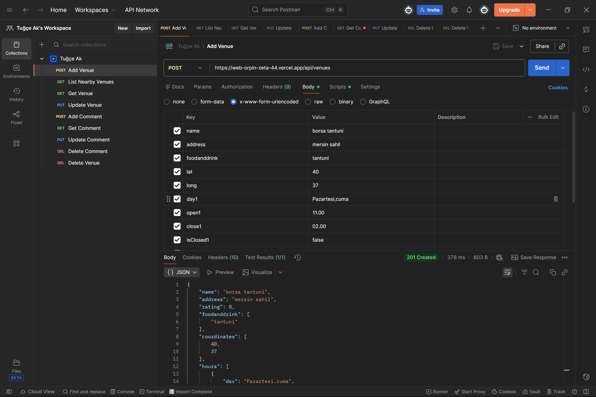
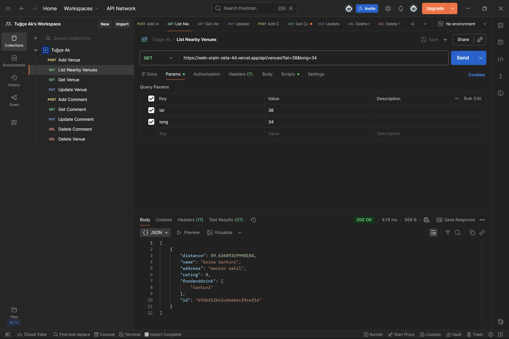
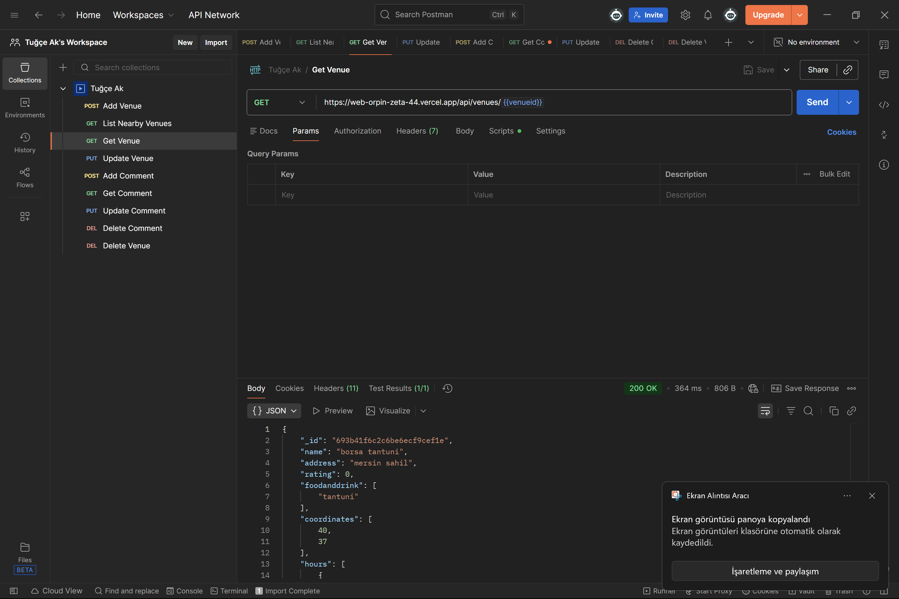
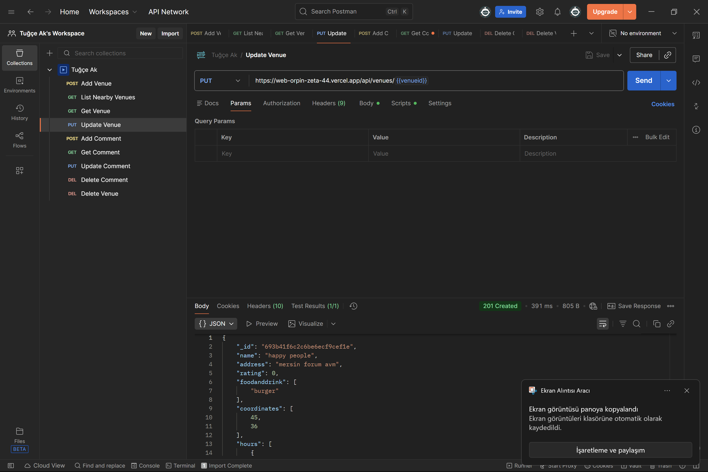
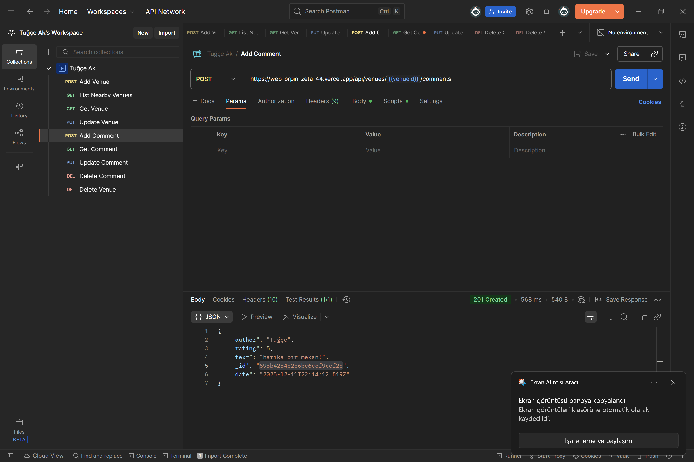
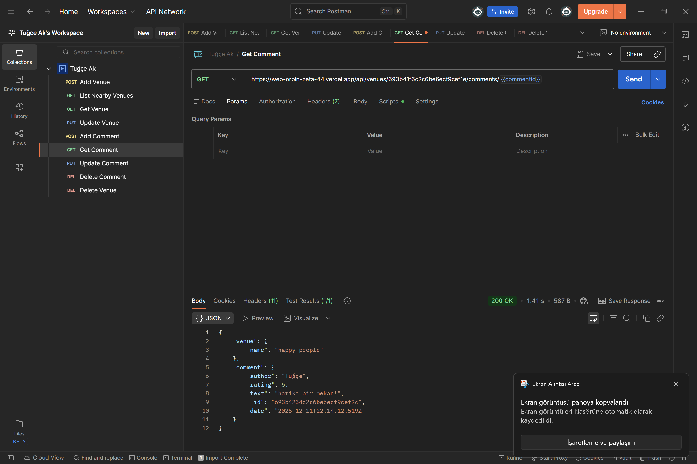
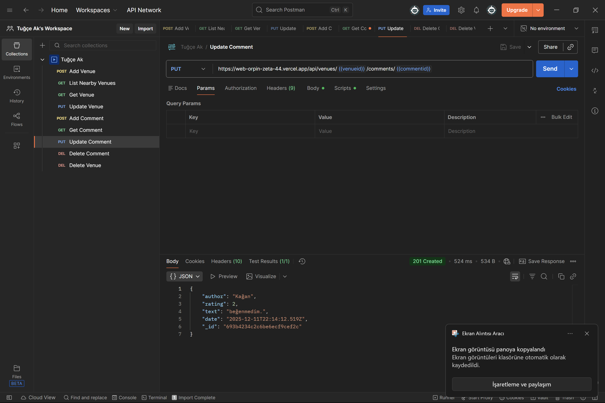
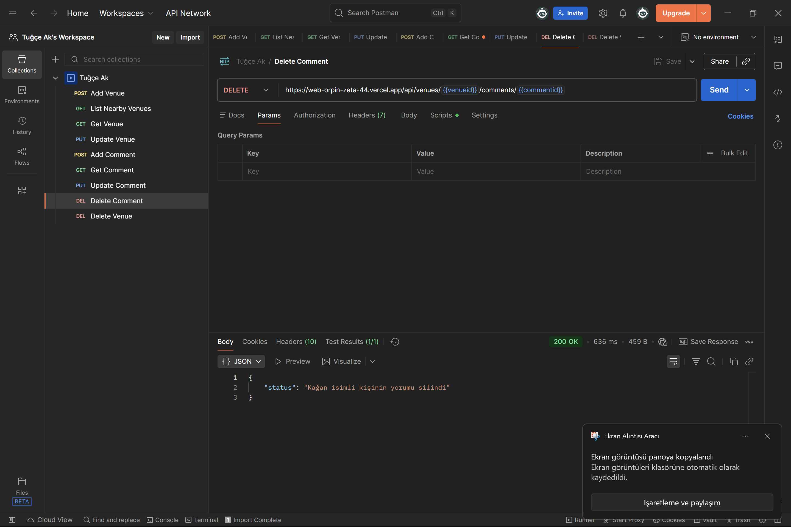
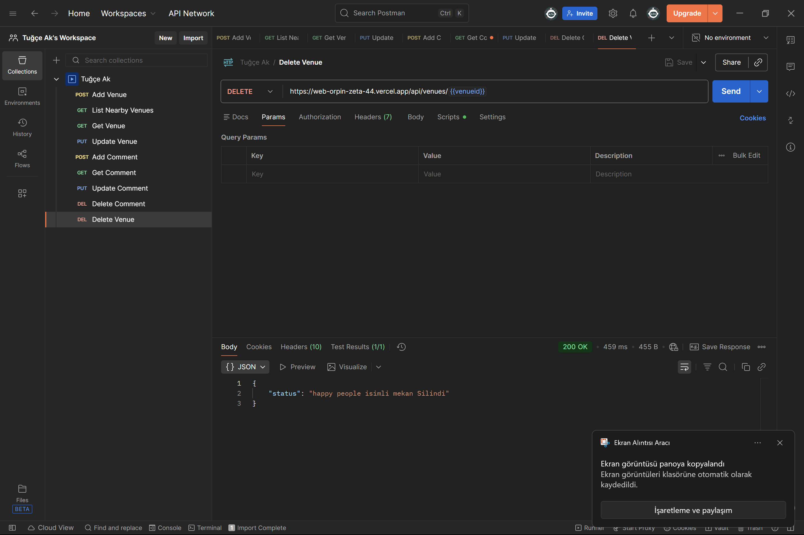

# API


🚀  [https://backend-six-coral-59.vercel.app](https://backend-six-coral-59.vercel.app)

---

##  Kurulum ve Çalıştırma 

Projeyi yerel ortamınızda çalıştırmak için aşağıdaki adımları izleyin:

```bash
# Depoyu klonlayın
git clone <repo-url>

# Dizin içine girin
cd project-directory

# Bağımlılıkları yükleyin
npm install

# Projeyi başlatın
npm start
```


#### 1. Mekan Ekleme (Add Venue)
Yeni bir mekan oluşturmak için kullanılır.


#### 2. Yakındaki Mekanları Listeleme (List Nearby Venues)
Belirli bir koordinat çevresindeki mekanları listeler.


#### 3. Mekan Getirme (Get Venue)
ID ile belirli bir mekanın detaylarını getirir.



#### 4. Mekan Güncelleme (Update Venue)
Mevcut bir mekanın bilgilerini günceller.



#### 5. Yorum Ekleme (Add Comment)
Bir mekana yeni bir yorum ekler.


#### 6. Yorum Getirme (Get Comment)
Tekil bir yorumun detaylarını getirir.


#### 7. Yorum Güncelleme (Update Comment)
Yapılan bir yorumu düzenler.


#### 8. Yorum Silme (Delete Comment)
Bir yorumu siler.


#### 9. Mekan Silme (Delete Venue)
Bir mekanı sistemden kaldırır.

---

